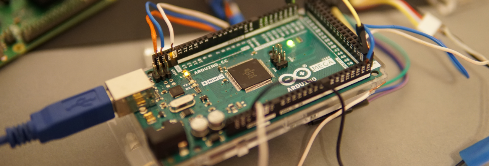

# Arduino - Learning
The repository contains some pieces of code which has been written by me to learn something.

## Programs list
- **HC-SR04** - Program testing [HC-SR04 Ultrasonic Ranging Module](https://cdn.sparkfun.com/datasheets/Sensors/Proximity/HCSR04.pdf).
- **Jezdzik** - Software for a self-driving robot.
- **LED Control Serial** - Program which allows you to turn on/off LED diode via serial communication.
- **Sygnalizacja** - Program which emulates traffic lights.
 
 

  

